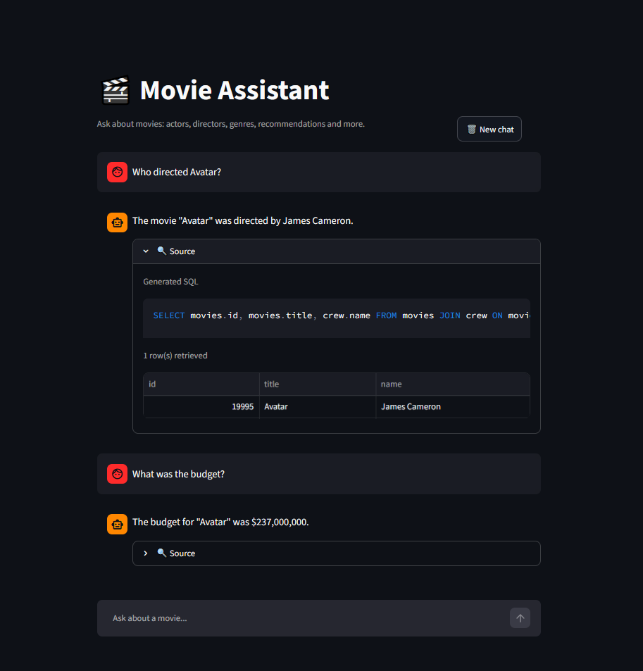
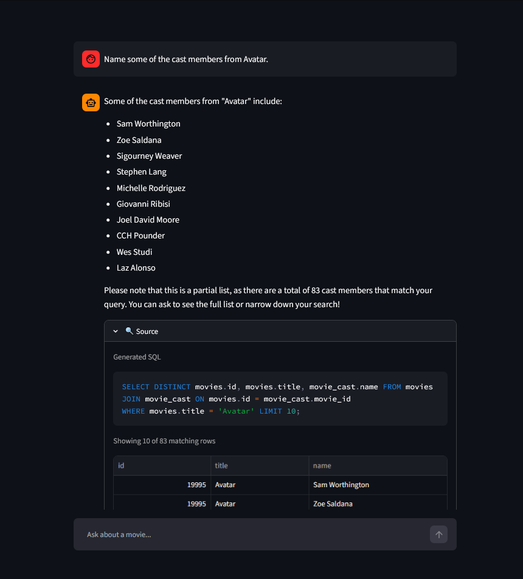
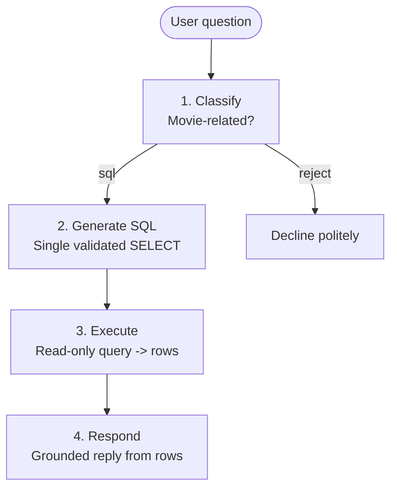

# Movie Assistant

A conversational AI agent that answers natural-language questions about movies over
the [TMDB 5000](https://www.kaggle.com/datasets/tmdb/tmdb-movie-metadata) dataset. It
combines structured retrieval (text-to-SQL over SQLite) with LLM response generation, exposes a FastAPI backend, and provides a Streamlit chat UI.

Capable of answering questions such as:

- *"Who directed Pulp Fiction?"* (factual lookup)
- *"Who was the lead actor in that movie?"* (context-aware follow-up queries)
- *"Recommend some sci-fi movies from the 1990s."* (filtered retrieval)
- *"Average budget of the movies Michael Caine starred in during the 2000s, vs Christian Bale's movies from the same time period?"* (aggregation)

## Sample Conversation





## How it works

Each turn runs a four-stage pipeline:



SQL is precise and auditable: perfect for exact facts, filters, and aggregates. The LLM adds another layer of understanding: interpreting fuzzy natural language, resolving follow-ups ("who directed it?"), and turning rows into readable prose. 

LLM answers are grounded in retrieved rows (not model weights or conversation history); this keeps responses faithful to the data. To ensure transparency, every answer exposes the SQL it ran and the rows it retrieved. This is visible in the API response and visualised in the UI's 'source' panel.

## Running the App

**Note**: The LLM client makes use of the OpenAI API and requires an API key for SQL generation and conversational responses. Add it to project .env or export as an environment variable. A temporary key can be provided for review purposes. 

## Quickstart: Docker

```bash
echo "OPENAI_API_KEY=sk-..." > .env      # your OpenAI key
docker compose up --build
```

The `ingest` service builds the database into a shared volume and exits; the API waits for it to finish, then the frontend waits for the API.

- API: <http://localhost:8000>
- UI: <http://localhost:8501>

API docs (Swagger) are served at <http://localhost:8000/docs>.


## Quickstart: Local (uv)

Requires Python 3.11+ and [uv](https://docs.astral.sh/uv/).

```bash
uv sync                                  # install dependencies
echo "OPENAI_API_KEY=sk-..." > .env

uv run python -m app.ingest              # build data/movies.db from the CSVs (<10s)

uv run uvicorn app.main:app --reload     # terminal 1, API at :8000
uv run streamlit run app/frontend.py     # terminal 2,  UI at :8501
```

If you prefer to use `pip`,  `requirements.txt` / `requirements-dev.txt` are provided as well.


## Configuration

Settings load from environment variables or a `.env` file (`app/config.py`):

| Variable          | Required | Default             | Purpose                              |
| ----------------- | -------- | ------------------- | ------------------------------------ |
| `OPENAI_API_KEY`  | for LLM  | N/A                   | OpenAI key (ingest does not need it) |
| `DB_PATH`         | no       | `data/movies.db`    | SQLite database location             |
| `LLM_CHAT_MODEL`  | no       | `gpt-4o-mini`       | Chat model                           |
| `LOG_LEVEL`       | no       | `INFO`              | Logging level                        |

---

## API

Interactive docs (Swagger UI) at `http://localhost:8000/docs`.

### POST /chat

**Request**
```json
{ "message": "Who directed Pulp Fiction?", "history": [] }
```

`history` is optional: a list of prior `{ "role": "user" | "assistant", "content": ... }`
turns provide conversational context.

**Response** `200`
```json
{
  "reply": "\"Pulp Fiction\" was directed by Quentin Tarantino.",
  "outcome": "ok",
  "sql": "SELECT movies.id, movies.title, crew.name FROM movies JOIN crew ON movies.id = crew.movie_id WHERE movies.title = 'Pulp Fiction' AND crew.job = 'Director'",
  "results": [{ "id": 680, "title": "Pulp Fiction", "name": "Quentin Tarantino" }],
  "total": 1
}
```

```bash
curl -s localhost:8000/chat -H 'content-type: application/json' \
  -d '{"message": "Who directed Pulp Fiction?"}'
```

**Outcomes and status codes**: the body always carries a user-facing `reply`.
`outcome` and the HTTP status explain how the query resolved:

| `outcome`      | Status | Meaning                                             |
| -------------- | ------ | --------------------------------------------------- |
| `ok`           | 200    | Answered from the data                              |
| `rejected`     | 200    | Off-topic, politely declined (a valid outcome)     |
| `llm_error`    | 503    | The LLM/upstream was unavailable                    |
| `lookup_error` | 500    | The query could not be processed                    |

Successful outcomes (answer or decline) are `200`; only dependency or
internal failures are `5xx`. This distinguishes real failures from normal replies for monitoring purposes.

`sql`/`results`/`total` fields expose the retrieval behind the answer.

### GET /health

Liveness check -> `{ "status": "ok" }`.


## Frontend

The Streamlit UI (`app/frontend.py`) is a chat interface that talks to the API
over HTTP (fully decoupled from the core). Each answer has a collapsible
`🔍 Source` panel showing the generated SQL and the retrieved rows. Results are
capped at 50 rows by default (`LIMIT 50`) unless the query sets its own limit;
when more rows match than were returned, the panel says so (e.g. "Showing 50 of
273 matching rows") instead of passing a truncated list off as complete.
A 'New chat' button allows the conversation to be reset.


## Data

The ingest script (`app/ingest.py`) loads the two TMDB CSVs into SQLite tables:
- `movies`
- `genres`
- `keywords`
- `movie_cast`
- `crew`. 

The script is idempotent (re-running does not duplicate rows), skips malformed rows with a warning, and
runs inside a single transaction. `--overwrite` flag drops the DB and rebuilds.

Indexes support genre/keyword filtering, name lookups, year ranges, crew/role lookups and rating sorts without full scans. 

**Note on "ratings":** the brief mentions a ratings table (MovieLens framing). This project uses TMDB, which has no per-user ratings; `vote_average` / `vote_count` are the analogue.

## Testing

```bash
uv run pytest        # ~40 tests
```

Test coverage focuses on the deterministic parts of the system:

- **Ingestion**: coercion, idempotency, FK cascade, relational linking.
- **SQL safety**: single-SELECT validator (accepts SELECTs; rejects `DROP`/`DELETE`/stacked statements) and the read-only connection (writes raise).
- **Router**: reject/failure outcomes via an injected fake client (not a live API).
- **API**: routing, request validation (422), and failure -> 503 mapping via FastAPI dependency overrides.

The LLM-dependent behaviour (prompt quality, grounding) was validated by manual end-to-end probing, conversational interaction and A/B testing of prompts.


## Design decisions & guardrails

- **LLM-generated SQL is defended in depth:** a read-only connection
  (`mode=ro`, writes rejected at the driver), a single-`SELECT` AST validator
  (`sqlparse`), and a result-set cap (`LIMIT 50`). The SQL prompt acts as *guidance*, these three
  are hard guarantees.
- **Grounded responses:** the response stage is instructed to use only the
  retrieved rows and never invent titles, which stops fabrication on empty
  results.
- **Vocabulary mapping:** the model is told the exact `genres`/`crew.job` values
  and to route non-genre themes (e.g. "sports") to the `keywords` table, so user
  wording maps to real DB values.
- **Truthful result sets:** a `COUNT` reveals the true total, so the agent says
  "showing 50 of 273" rather than presenting a truncated list as complete.
- **Stateless API:** conversation history is passed per request; the server holds
  no session.

## Known limitations

This is a proof of concept; the following are known and intentionally out of scope:

- **Pagination.** The agent honors "list all" and discloses totals, but there's no
  true "show me the next 10". This would require `OFFSET` + conversation state.
- **Multi-part queries.** A question with multiple different result shapes ("avg
  budget *and* top-5 films") is answered partially. Full support would require a
  query-decomposition planner (run several queries, synthesize).
- **Lack of semantic search.** Keyword matching is lexical (`LIKE`), so it misses synonyms
  ("sports" != "athlete"). See [Future Work](#future-work) for vector search.
- **Aggregates on sparse columns.** `AVG(budget)` includes movies stored with
  `budget = 0` (missing TMDB data); this skews averages low.
- **Data coverage.** TMDB 5000 is ~5000 mostly-popular films, so "not found" can
  mean "not in this dataset" (e.g. Tarkovsky's *Stalker*), not "doesn't exist".
- **Biographies.** "Who is X?" returns the person's filmography: the DB has no
  bios.
- **Sessions.** The UI's chat is client-side and ephemeral, and
  history is unbounded; production would need a session store and history
  windowing/summarization (as well as hard limits on conversation length).
- **Exposed SQL.** The API returns the generated SQL for transparency. This works for a
  demo, but a production deployment should gate it behind a debug/admin flag.

## Future Work
- E2E LLM evaluation suite (e.g. DeepEval with LLM-as-judge for output / retrieval correctness) 
- Vector search over overviews/keyword embeddings, for "movies like X" / vibe-driven queries, using a vector store like Chroma or pgvector
- Agentic reasoning, planning and multi-step execution (e.g. LangGraph with a ReAct loop for query decomposition, retrieval, synthesis)
- LLM observability (e.g. Langfuse): token usage / cost tracking, number of LLM failures/retries, recording traces
- Augmenting retrieval with live external sources (IMDb, Letterboxd, TMDB's own API) to cover films outside the static dataset

## Project structure

```
app/
  config.py            # settings (pydantic-settings)
  ingest.py            # CSV -> SQLite loader
  main.py              # FastAPI app (/chat, /health)
  models.py            # request/response schemas
  frontend.py          # Streamlit chat UI
  db/
    db.py              # read-only query layer + result cap
    schema.sql         # table definitions & indexes
  llm/
    client.py          # OpenAI wrapper (classify / generate_sql / generate_response)
    prompts.py         # system prompts + DB vocabulary
    query_router.py    # orchestration + error boundary
  tests/               # pytest suite
Dockerfile  
docker-compose.yml
```
